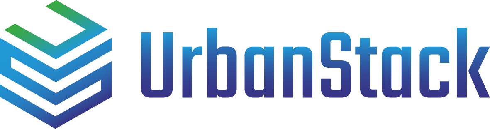
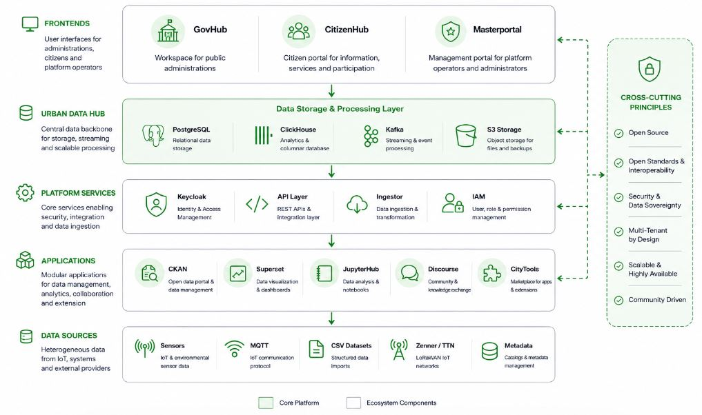
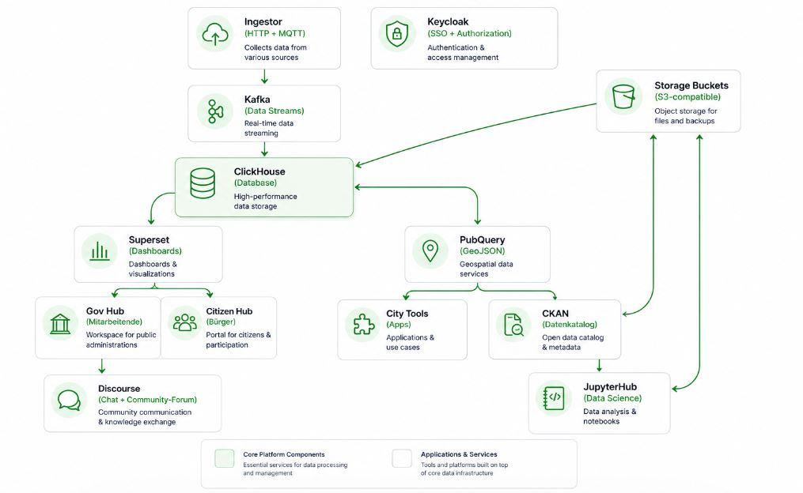
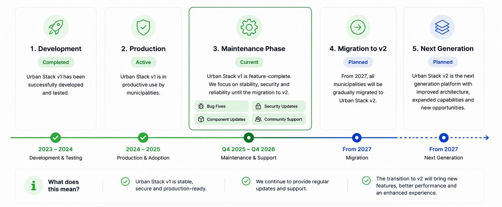

  

  <strong>An open digital ecosystem built by municipalities for municipalities.</strong>

  
  
  
  
  
  

  Open Source • Multi-Tenant • Digital Sovereignty • Community Driven

 

## Overview

Urban Stack is an open digital ecosystem that enables municipalities, public institutions, and municipal organizations to collaboratively develop, operate, and scale digital solutions.

By combining **Open Source**, **Software-as-a-Service**, and a strong **community-driven approach**, Urban Stack provides a shared foundation for sustainable and sovereign digital transformation in the public sector.

 

## Why Urban Stack?

Municipalities are facing increasing challenges:

- Digital transformation of administrative services
- Demographic change and workforce shortages
- Growing volumes of data
- Increasing requirements for governance, transparency, and efficiency
- Limited financial and technical resources

At the same time, many municipalities solve identical problems independently, leading to:

- Duplicate development efforts
- Fragmented software landscapes
- Vendor lock-in
- Increased costs

Urban Stack addresses these challenges through a shared, reusable, and collaborative digital foundation.

 

## Platform Overview

Urban Stack combines four core building blocks into a unified municipal ecosystem.

### 🏛️ Urban Data Hub

Data integration, governance, interoperability, identity management, and real-time processing.

### 📊 Urban Gov Hub

Analytics, dashboards, reporting, monitoring, and data-driven decision making for public administrations.

### 🌍 Urban Citizen Hub

Citizen services, participation, transparency, and digital communication.

### 🧩 City Tools Marketplace

Reusable applications, shared innovation, and collaborative development across municipalities.

Together, these components create a common digital foundation that municipalities can build upon collaboratively.

 

# Architecture

  

Urban Stack consists of several interconnected layers that together form a complete municipal digital ecosystem.

## Core Components

### Urban Data Hub

The technical backbone of Urban Stack.

**Capabilities**

- Data Integration
- Data Storage
- Identity & Access Management
- APIs & Interoperability
- Real-Time Data Processing

### Urban Gov Hub

The workspace for public administrations.

**Capabilities**

- Data Analytics
- Dashboards & Reporting
- KPI Monitoring
- Administrative Use Cases
- Data-Driven Decision Making

### Urban Citizen Hub

The citizen-facing layer of the ecosystem.

**Capabilities**

- Public Information
- Citizen Participation
- Digital Services
- Transparent Communication

### City Tools Marketplace

A marketplace for reusable municipal applications and extensions.

Municipalities can:

- Discover solutions
- Deploy applications
- Share innovations
- Reuse existing developments

This reduces implementation costs, accelerates adoption, and promotes long-term sustainability.

 

# Data Flow

  

Urban Stack integrates data from various municipal systems and provides a unified foundation for analytics, services, participation, and innovation.

 

# Key Principles

Urban Stack is built on four fundamental principles.

### 🔓 Open Source First

Urban Stack is based entirely on Open Source technologies, ensuring transparency, flexibility, and long-term sustainability.

### 🏛️ Shared by Municipalities

Solutions are developed once and can be reused by many municipalities, reducing costs and duplication.

### 🔐 Digital Sovereignty

Municipalities retain full control over their data, governance, and operational decisions.

### 🤝 Community Driven

Knowledge, standards, and innovation are shared across organizational boundaries.

 

# Vision

Our vision is to establish a common digital foundation for municipalities that:

- Reduces duplication
- Strengthens collaboration
- Accelerates innovation
- Ensures digital sovereignty
- Enables sustainable digital transformation at scale

Urban Stack demonstrates that municipal digitalization is most effective when it is developed, operated, and continuously improved together.

 

# Roadmap

  

 

# Get Involved

### 🌐 Website

Explore the Urban Stack ecosystem and learn how municipalities collaborate to build shared digital infrastructure.

https://urbanstack.de

### 📖 Documentation

Access technical documentation, architecture guides, deployment instructions, and API references.

https://docs.urbanstack.de

### 🐛 Issues & Feature Requests

Report bugs, request features, or share ideas.

https://github.com/Urban-Stack/Urban-Stack-V1/issues

### 🤝 Contributing

We welcome municipalities, public institutions, developers, researchers, and partners who want to contribute to the Urban Stack ecosystem.

Whether you contribute code, documentation, ideas, standards, or municipal use cases, every contribution helps strengthen digital sovereignty and collaboration across municipalities.

 

# License

This project is licensed under the **AGPL** License.

See the [LICENSE](LICENSE) file for details.

 

  <strong>Built by municipalities. Shared with municipalities. Powered by Open Source.</strong>

