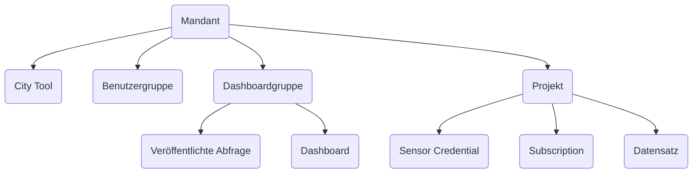
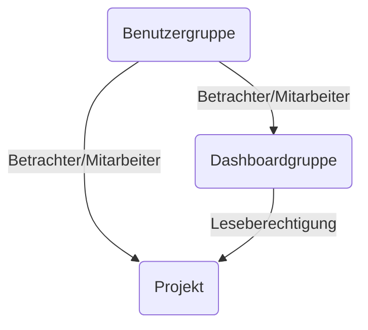

# Berechtigungskonzept der Plattform

## Mandant

Mandanten bilden die oberste Organisationseinheit. In der Regel ist jeder Nutzer aufgrund von Gruppenzugehörigkeit genau einem Mandanten zugeordnet.

## Projekt

Projekte sind dafür verantwortlich, Daten zu bündeln und Berechtigungen an diesen vereinheitlicht zu verwalten. Alle Daten (sowohl Sensordaten als auch sonstige Daten) in der Plattform sind in Projekten organisiert.

Projekte sind Mandanten untergeordnet, ein Projekt ist also genau einem Mandanten untergeordnet, allerdings kann ein Mandant mehrere Projete haben.

## Benutzergruppe

Benutzergruppen sind dafür verantwortlich, Nutzer zu bündeln und deren Berechtigungen vereinheitlicht zu verwalten.

Genau wie Projekte sind Gruppen Mandanten untergeordnet.

Eine Beispielkonfiguration könnte so aussehen:

- Alle Benutzer, die Mitglied in der Benutzergruppe "Umweltbetrieb" des Mandanten "Gütersloh" sind, haben Schreibberechtigungen auf das Projekt "Umweltdaten".
- Alle Benutzer, die Mitglied in der Benutzergruppe "Verkehr" sind, haben nur Lesezugriff auf das Projekt "Umweltdaten".
- Nutzer, die Mitglied in beiden Benutzergruppen sind, erhalten die höheren Rechte, also Schreibberechtigungen.

<!-- prettier-ignore -->
!!! warning "Bitte beachten!"
    Die Administratoren einer Benutzergruppe können nicht nur die Zugehörigkeit von Benutzern zu dieser Benutzergruppe einstellen
    sondern auch die Benutzer in der Benutzergruppe administrieren, also Passwörter und Namen ändern!
    Daher sollten Administrationsrechte auf Benutzergruppen nur an einen kleinen Kreis geeigneter Personen vergeben werden.

## Dashboardgruppe

Dashboardgruppen sind dafür verantwortlich, Dashboards zu bündeln. Dabei können einerseits Benutzergruppen Betrachter- bzw. Mitarbeiter-Berechtigungen an Dashboardgruppen haben, auf der anderen Seite können Dashboardgruppen Leseberechtigungen an Projekten haben. Betrachter-Berechtigung bedeutet, dass ein rein lesender Zugriff besteht, die Dashboards können zwar betrachtet, aber nicht verändert werden. Mitarbeiter-Berechtigungen bedeutet, dass auch Dashboards bearbeitet, erstellt und gelöscht werden können.

Genau wie Benutzergruppen und Projekte sind Dashboardgruppen Mandanten untergeordnet.

Eine Beispielkonfiguration könnte so aussehen:

- Alle Benutzer, die Mitglied in der Benutzergruppe "Umweltbetrieb" des Mandanten "Gütersloh" sind, haben Betrachter-Berechtigungen auf die Dashboardgruppe "Straßen" und damit auf alle darunterliegenden Dashboards.
- Alle Benutzer, die Mitglied in der Benutzergruppe "Verkehr" sind, haben Mitarbeiter-Berechtigungen auf die Dashboardgruppe "Straßen". Die Dashboardgruppe "Straßen" kann lesend auf alle Daten im Projekt "Hauptstraße" zugreifen.
- Wenn ein Mitglied der Benutzergruppe "Umweltbetrieb" ein Dashboard in der Dashboardgruppe "Straßen" betrachtet, sieht es nur die Daten des Projektes "Straßen", egal ob es auf dieses Projekt berechtigt ist oder ob es noch auf andere Projekte berechtigt ist, da in einem Dashboard nur die Leseberechtigungen der Dashboardgruppe an Projekten ausgewertet wird.

## City Tool (Static App)

[Static Apps](citytools.md#static-apps) sind einfache Webanwendungen, die von jedem Mandant separat installiert und konfiguriert werden können. Es gibt einen vorgegebenen Katalog von Webanwendungen, die über den City-Tools-Mechanismus installiert werden können.

City Tools sind Mandanten untergeordnet.

## Dashboards

Dashboards sind Dashboardgruppen untergeordnet und erben deren Berechtigungen. Alle Dashboards einer Dashboardgruppe haben die gleichen Berechtigungen, auf Daten von Projekten zuzugreifen.

## Sensor Credentials

Sensor Credentials sind Projekten untergeordnet und werden dafür verwendet, Daten über eine [HTTP-Schnittstelle](schnittstellen/ingestor.md#http) an die Plattform zu übergeben. Die Daten werden dem übergeordneten Projekt zugeordnet.

## Subscriptions

Subscriptions sind ebenfalls Projekten untergeordnet und werden dafür verwendet, Daten über [MQTT abzufragen](schnittstellen/ingestor.md#mqtt). Auch hier gilt, dass mit dem übergeordneten Projekt festgelegt ist, in welchem Projekt die Daten abgelegt werden.

## Veröffentlichte Abfragen

Veröffentlichte Abfragen sind gespeicherte SQL-Abfragen, die einer Dashboardgruppe untergeordnet sind. Diese sind öffentlich abfragbar und werden mit den Berechtigungen der Dashboardgruppe ausgeführt, für die Abfrage sind also alle Sensordaten sichtbar, auf die die Dashboardgruppe Leseberechtigungen hat. Weitere Informationen finden sich in der [Dokumentation über Veröffentlichte Anfragen](schnittstellen/veröffentlichte-abfragen.md).

## Datensätze

Datensätze sind Projekten untergeordnet und werden verwendet, um Daten (wie z.B. CSV oder JSON)
aus [Storage Buckets](schnittstellen/buckets.md) in Superset bereitzustellen. Weitere Informationen finden sich in
der [Dokumentation des Datei-Managers](./filemanager.md#datei-verknupfen).
