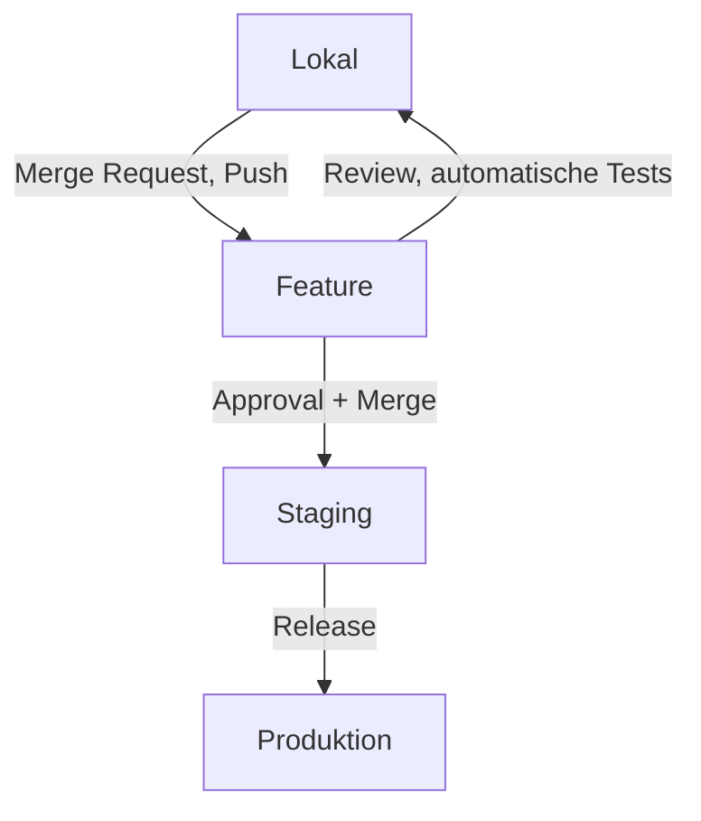

# CI/CD und Tests

Die Plattformkomponenten und das Deployment werden über einen mehrstufigen Testprozess fortlaufend automatisiert getestet, sodass für alle Änderungen die korrekte Funktionsweise der Komponenten, der Plattform als Ganzes und die Einhaltung von Coderichtlinien sichergestellt ist.

## Entwicklungsfluss

## End-to-End-Tests

Die korrekte Integration der Komponenten wird durch End-to-End-Tests sichergestellt, bei denen Funktionen automatisch aus Benutzersicht geprüft werden.

Diese Tests werden hauptsächlich mit [Playwright](https://playwright.dev/) durchgeführt.
