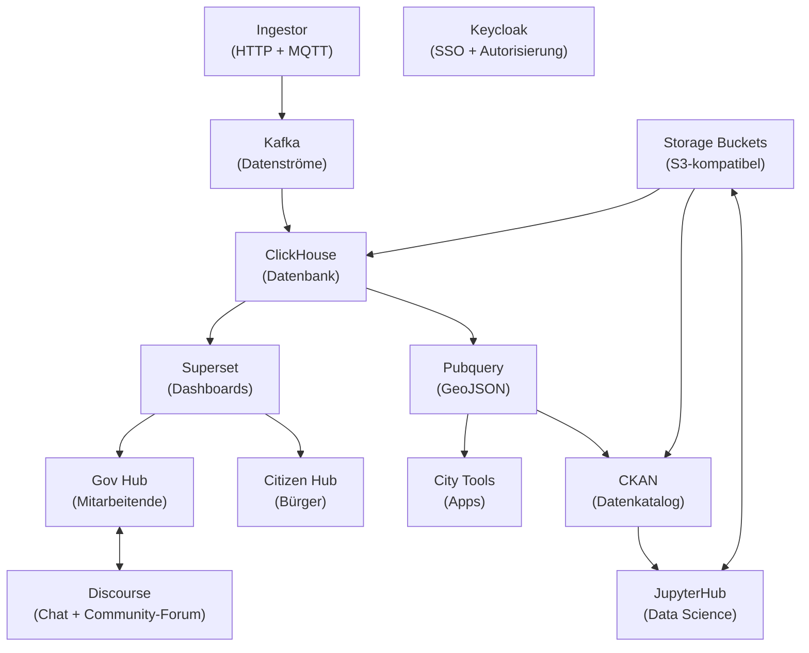

# Überblick

Das folgende Diagramm zeigt grob vereinfacht den Datenfluss in der Plattform.

```mermaid
flowchart TD
  Ceph["Storage Buckets<br/>(S3-kompatibel)"]
  Ingestor["Ingestor<br/>(HTTP + MQTT)"]
  Keycloak["Keycloak<br/>(SSO + Autorisierung)"]
  Kafka["Kafka<br/>(Datenströme)"]
  ClickHouse["ClickHouse<br/>(Datenbank)"]
  Pubquery["Pubquery<br/>(GeoJSON)"]
  Jupyter["JupyterHub<br/>(Data Science)"]
  GovHub["Gov Hub<br/>(Mitarbeitende)"]
  CitizenHub["Citizen Hub<br/>(Bürger)"]
  Citytools["City Tools<br/>(Apps)"]
  Discourse["Discourse<br/>(Chat + Community-Forum)"]
  Superset["Superset<br/>(Dashboards)"]
  CKAN["CKAN<br/>(Datenkatalog)"]

  Ingestor --> Kafka
  Kafka --> ClickHouse
  Ceph --> ClickHouse
  CKAN --> Jupyter
  GovHub <--> Discourse
  ClickHouse --> Superset
  ClickHouse --> Pubquery
  Superset --> GovHub
  Superset --> CitizenHub
  Pubquery --> CKAN
  Ceph --> CKAN
  Pubquery --> Citytools
  Ceph <--> Jupyter
```
