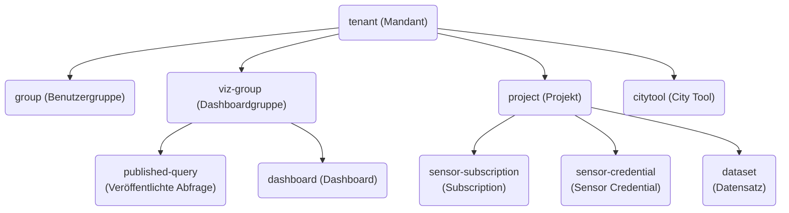

# Implementierungsdetails Ressourcen-API

## Übersicht Ressourcen-Typen



## Ressource

Eine Ressource ist eine konkrete Instanz eines Ressourcen-Typs, z.B. der `tenant` `detmold`.

## Scope

Scopes legen fest, _was_ man mit einer Ressource machen kann. Hat man z.B. den `project:bucket-read` Scope auf einem `project`, kann man die Daten des Storage Buckets dieses `projects` lesen.

Scopes haben immer die Form `resourcetype:scope`, also z.B. `project:clickhouse-read`. Für jeden Ressourcen-Typ gibt es `admin`, `read` und `view` Scopes, deren Bedeutung im Punkt [DatahubPolicyProviderFactory](#datahubpolicyproviderfactory) erklärt wird.

## Principal

Principals legen fest, _wer_ etwas mit einer Ressource machen kann. Principals sind vor allem `user`, `group` und `tenant`, aber auch Ressourcen, wie `viz-group` können als Principal verwendet werden.

## Permission

Als Permission wird die Kombination von einer Ressource, einem oder mehreren Scopes und einem oder mehreren Principals bezeichnet. Damit kann der Principal mit der Ressource die in den Scopes festgelegten Dinge tun, wie z.B. eine Ressource sehen. Um eine Permission sehen, löschen oder erstellen zu können, muss man den `admin` Scope auf der Ressource haben, außerdem muss man für das Erstellen alle angegebenen Principals sehen können.

## Namensschema

Alle Ressourcen haben einen Namen, der durch folgende Regex beschrieben ist:

```re
[a-z0-9]([-a-z0-9]{0,34}[a-z0-9])?
```

Erlaubt sind nur alphanumerische Zeichen sowie `-` (allerdings nicht am Anfang und Ende), außerdem muss der Name mindestens ein Zeichen und höchstens 36 Zeichen haben.

## SPIs

Um diese Ressourcen in einem einheitlichen Berechtigungskonzept zu vereinen, wurden mehrere Keycloak SPIs auf Basis der [Authorization Services](https://www.keycloak.org/docs/latest/authorization_services/index.html#_overview_terminology) implementiert:

### `DatahubResourceProviderFactory`

Implementiert `RealmResourceProviderFactory`. Diese Komponente hat die Aufgabe, die Ressourcen-API als GraphQL- und REST-API bereitzustellen. Hier können auch weitere auf HTTP basierende Endpunkte angelegt werden, wenn das für die Plattform benötigt wird. Aktuell implementierte Endpunkte (nach dem Basispfad `https://login.DOCS_BASE_DOMAIN/realms/udh/data-hub`):

- `/graphiql`: Grafischer GraphQL-Explorer, mit dem Queries und Mutations erstellt und ausgeführt werden können.
- `/_viz-group-projects/{tenant}/{vizGroup}`: Hier fragt Superset ab, welche Projekte und Datenbanken die `viz-group` sehen darf. Nur der Superset Client kann diesen Endpunkt benutzen.
- `/_published-query/{tenant}/{vizGroup}/{query}`: Hier fragt die [pubquery-Komponente](../schnittstellen/veröffentlichte-abfragen.md) ab, welche SQL-Abfrage ausgeführt werden soll und welche Projekte die `viz-group` sehen darf. Nur der pubquery-Client kann diesen Endpunkt benutzen.
- `/_repair`: Führt interne Reparaturen durch, die nach Änderungen an der Ressourcen-API notwendig werden können. Nur der data-hub Client kann diesen Endpunkt benutzen, dieser Endpunkt wird vom `post-install/post-upgrade` Helm Hook aufgerufen.

### `UdhTokenMapper`

Implementiert `ProtocolMapper`. Diese Komponente hat die Aufgabe, beim OAuth/OIDC-Flow weitere Attribute über den userinfo-Endpunkt bereitzustellen bzw. in das OIDC-Token zu schreiben. Z.B. werden für Discourse und CKAN im `group`-Claim übergeben, bei welchen Mandanten der Nutzer welche Rechte hat.

### `DatahubPolicyProviderFactory`

Implementiert `PolicyProviderFactory`. Diese Komponente hat die Aufgabe, die hierarchische Struktur des Berechtigungssystems mit Keycloak zu vereinen:

- Wenn man den `admin` Scope auf einer Ressource besitzt, hat man auch automatisch alle anderen Scopes auf dieser Ressource.
- Wenn man den `read` Scope auf einer Ressource besitzt, hat man auch automatisch alle anderen rein lesenden Scopes auf dieser Ressource, also `view` Scopes und Scopes die auf `-read` enden.
- Wenn man einen Scope auf einer Ressource besitzt, hat man diesen auch in allen untergeordneten Ressourcen (z.B. der Scope `dashboard:view` auf einer `viz-group` impliziert `dashboard:view` auf allen Dashboards, die unter dieser `viz-group` liegen).
- Eine Ressource ist nur dann sichtbar, wenn man auch alle übergeordneten Ressourcen sehen kann, wenn man also die entsprechenden `view` Scopes hat. Dies gilt nicht für Ressourcen, die Scopes auf anderen Ressourcen haben (z.B. eine `viz-group` die Scopes auf einem `project` hat).

Außerdem ist hier implementiert, dass man in der Admin UI nur die `groups` sehen kann, die man nach Berechtigungskonzept sehen kann.

### `DatahubResourcePolicyProviderFactory`

Implementiert `PolicyProviderFactory`. Diese Komponente ist dafür verantwortlich sicherzustellen, dass eine Ressource als Principal Rechte auf einer anderen Ressource haben kann (z.B. kann eine `viz-group` den Scope `clickhouse-read` auf einem `project` haben, damit werden im Kontext dieser `viz-group` in Superset nur die Daten aus den `projects` angezeigt, auf die die `viz-group` berechtigt ist).

## Ressourcen

Hier ist dokumentiert, wie die einzelnen Ressourcen der Ressourcen-API mit den restlichen Komponenten der Plattform verbunden sind.

### `tenant`

Beim Anlegen eines `tenant` ([Mandant](../berechtigungskonzept.md#mandant)) wird eine Permission eingerichtet, sodass alle `user`, die Mitglied in einer `group` des `tenants` sind, den `tenant` sehen können. Außerdem werden zwei `groups` erstellt:

- admin, die durch den Scope `tenant:admin` Adminzugriff auf den gesamten `tenant` und alle Ressourcen darunter erhält
- read, die durch den Scope `tenant:read` Lesezugriff auf den gesamten `tenant` und alle Ressourcen darunter erhält

Des Weiteren wird eine Gruppe in Keycloak angelegt. Ist ein `tenant` als Principal auf einer Ressource berechtigt, gilt diese Berechtigung für alle Gruppenmitglieder dieses `tenants` sowie aller Untergruppen.

In Discourse wird eine Kategorie sowie eine Lese- und Admingruppe für jeden `tenant` erstellt.

In CKAN wird eine Organisation für jeden `tenant` erstellt.

Scopes:

- `discourse-member`: Gibt Zugriff auf die Kategorie des `tenants` in Discourse
- `discourse-moderator`: Gibt Moderationszugriff auf die Kategorie des `tenants` in Discourse
- `ckan-admin` : Gibt Adminzugriff auf die Organisation des `tenants` in CKAN
- `ckan-editor` : Gibt Editorzugriff auf die Organisation des `tenants` in CKAN
- `ckan-member` : Gibt Memberzugriff auf die Organisation des `tenants` in CKAN

### `group`

Bein Anlegen einer `group` ([Benutzergruppe](../berechtigungskonzept.md#benutzergruppe)) wird eine Untergruppe in Keycloak unter der `tenant`-Gruppe angelegt.

### `viz-group`

`viz-groups` ([Dashboardgruppe](../berechtigungskonzept.md#dashboardgruppe)) werden als Principals verwendet, um ihren untergeordneten Dashboards Zugriff auf `projects` zu geben.

### `dashboard`

Beim Anlegen eines `dashboard` ([Dashboard](../berechtigungskonzept.md#dashboards)) wird automatisch ein Dashboard mit dem Slug `${tenant}_${viz-group}_${dashboard}` in Superset angelegt.

### `project`

Beim Anlegen eines `project` ([Projekt](../berechtigungskonzept.md#projekt)) wird ein S3-kompatibler [Storage Bucket](../schnittstellen/buckets.md#storage-buckets) angelegt. Auch wird ein ClickHouse-User und eine Superset-Database angelegt, die später für die `datasets` benutzt werden.

Scopes:

- `clickhouse-read`: Gibt Lesezugriff auf die Sensordaten des `project` in der ClickHouse-Datenbank
- `bucket-read`: Gibt Lesezugriff auf den zum Projekt gehörenden Storage Bucket
- `bucket-write`: Gibt Schreibzugriff auf den zum Projekt gehörenden Storage Bucket

### `citytool`

Beim Anlegen eines `citytool` wird ein S3-kompatibler Storage Bucket mit dem Namen `ct.${tenant}.${citytool}` angelegt, auch ein Pfad ist frei wählbar, der allerdings dem Namensschema aller Ressourcen entsprechen muss. Das citytool ist dann unter `https://citytools.DOCS_BASE_DOMAIN/${tenant}/${path}/` verfügbar. Außerdem wird der citytools Ingress so angepasst, dass zuerst Dateien im Storage Bucket gesucht werden und danach in den statischen Dateien des City-Tools-Containers. Dadurch können die `citytools` für jeden `tenant` individuell konfiguriert werden.

Siehe auch [Static Apps](../citytools.md#static-apps).

Scopes:

- `admin`: Gibt Schreibzugriff auf den Storage Bucket des `citytool`

### `sensor-subscription`

Alle `sensor-subscriptions` ([Subscription](../berechtigungskonzept.md#subscriptions)) werden in ein Kubernetes-Secret geschrieben, welches vom [Ingestor](../schnittstellen/ingestor.md#mqtt) gelesen wird, welcher die entsprechenden MQTT-Subscriptions verwaltet.

Über die [GraphQL-Schnittstelle](../schnittstellen/graphql.md) können alle Metadaten, mit Ausnahme des Passwortes, ausgelesen werden.

### `sensor-credential`

Beim Anlegen eines `sensor-credential` ([Sensor Credential](../berechtigungskonzept.md#sensor-credentials)) wird in Keycloak ein Client mit Service Account angelegt und in den Claims der Zugriff auf das übergeordnete `project` freigegeben. Diese Credentials können dann für den [Ingestor](../schnittstellen/ingestor.md#http) verwendet werden.

Scopes:

- `rotate`: Erlaubt es, dieses `sensor-credential` zu rotieren, es werden also neue Credentials ausgegeben und die alten werden ungültig

### `published-query`

Über die [pubquery-Komponente](../schnittstellen/veröffentlichte-abfragen.md) können die hier hinterlegten `published-queries` ([Veröffentlichte Anfrage](../berechtigungskonzept.md#veroffentlichte-abfragen)) öffentlich zugänglich abgefragt werden. Dafür gibt es einen HTTP-Endpoint (`_published-query/{tenant}/{vizGroup}/{query}`) den die pubquery-Komponente mit einem extra dafür provisionierten Service Account abfragen kann. Dabei wird die hinterlegte Query und die Projekte, die die `published-query` lesen kann, zurück gegeben.

### `dataset`

Beim Anlegen eines `dataset` ([Datensatz](../berechtigungskonzept.md#datensatze)) wird in Superset ein neues Dataset angelegt, welches den mit dem `project` angelegten Clickhouse-User benutzt um auf die angegebene Datei im Storage Bucket zuzugreifen.

Scopes:

- `refresh`: Erlaubt es, Superset anzuweisen, das Schema dieses Datasets zu aktualisieren
